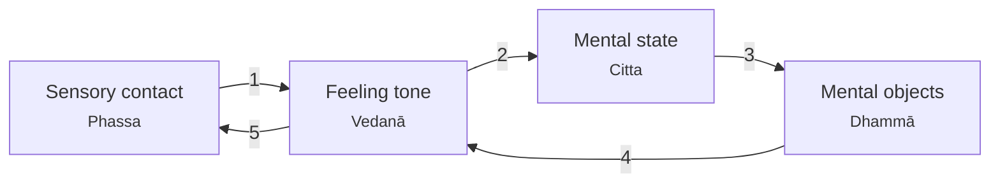
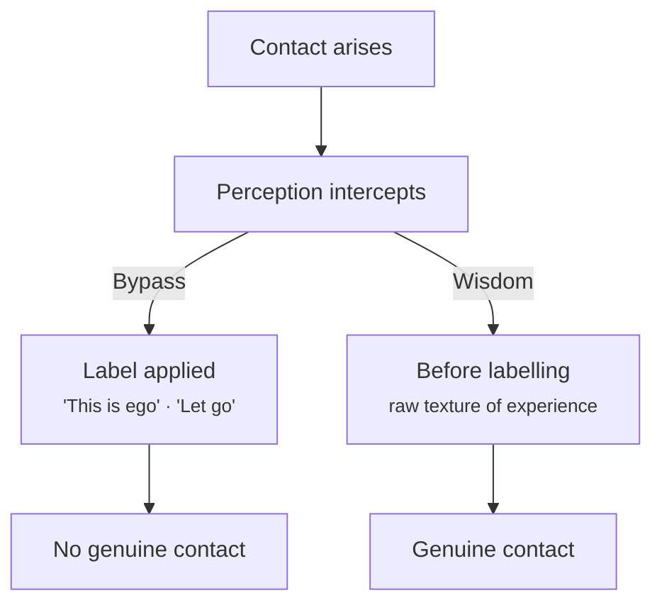

# Spiritual Bypassing

Spiritual Bypassing is a common pattern for those learning Buddhism. Put simply:

_Spiritual bypassing means using spiritual ideas or practices to sidestep emotions you haven't actually worked through._

It's very similar to the "positive mindset" pattern, wrapped up in a spiritual guise. This is a simple enough trap because there are so many "bumper sticker"-like platitudes that Buddhism offers: "there is no self" or "it's all an illusion". Whether these are true or not, the issue is whether we use these to avoid our direct experience. 

Take a relatable situation: you notice something about your body that you don't like - you have a pimple, or you are getting older, you think you're too fat. The bypassing that could come here is a thought like "everything is impermanent" or "the body doesn't matter". It's not too different from a the body positive movement, wrapped in a spiritual pretext.

The point is not whether the thought is correct or not. The thought itself is somewhat irrelevant. What matters is a complete understanding (and acknowledging) of the sequence that lead to the thought.

### Thoughts arising

The thoughts arrive through several stages:

The interaction between each stage is roughly:

1. There is an initial contact with some sense (sight, sound, etc). This generates a feeling tone that is either pleasant, unpleasant, or neutral.
2. The feeling tone constructs a mental state - something like anxiety, boredom, or excitement.
3. Out of the mental state arises some thoughts, or mental objects. In our "I'm getting older" example above, those could be "I am running out of time" or "I haven't achieved anything important yet".
4. These mental objects will similarly product a feeling tone and compound on themselves.
5. The overall loop can produce even more raw bodily sensations - increased heart rate, tightness, contraction, restricted breathing, etc.

This framework should be loosely-held. These processes are more like a web than a perfect system.

Spiritual bypassing is the over-emphasis on the _mental objects_, without acknowledgement of the feeling tone and the mental state. The mind reaches for an interpretive overlay and the feeling itself is never consciously experienced.

### Noticing

No surprises, the way to resolve spiritual bypassing is through mindfulness. If you catch yourself "spiritualizing", look earlier in the loop: label the mental state underlying the thought and label the feeling tone(s) inside the body. 

If possible, come back to the original sensory contact that triggered the chain. In Buddhism there are considered to be six sense bases rather than the tradition five we have in western cultures: eyes, ears, tongue, body, nose, and _mind_. 

From the mind rises mental objects (thoughts, memories, images, concepts), similar to smell arising from the nose. This makes the diagram above incomplete - a thought isn't just something that arises *after* sensory contact, it is also a form of sensory contact. This is basically what's happening when you lie awake at 3am: no new sensory contact from the world, but the anxiety continues to compound in a way that doesn't allow you to fall asleep.

Mental objects should be treated no differently than any other sense: notice them as arising from the mind like smells from the nose, note their feeling tone, and refrain from proliferating them. 

For example, the thought "I said something embarrassing yesterday" is usually followed by a mindless replay: self-criticism, the imagined consequences, how to avoid doing it again. 

We can create a gap with a moment of recognition ("thinking is happening"). Then shift your focus to the feeling tone rather than allowing the mental objects to loop back on themselves, or - in the case of spiritual bypassing - simply ignoring that the feeling tone and mental states exist.

### Persistant loops

If a memory keeps arising with high charge, simply noting "thinking, thinking" and returning to the breath might be bypassing something that actually needs attention. If you are "sitting" with a thought pattern, you can distinguish between:

1. _proliferation_: compulsive proliferation that generates more suffering (_papañca_)
2. _contemplation_: deliberately staying with a difficult mental object to understand it

It's not easy to know which one you're doing. The practical test is whether engagement is increasing the charge or decreasing it.

If sitting with a thought makes it clearer, less sticky, more workable, that's contemplation. Genuine reflection on something you did has a quality of curiosity and some distance. You're trying to understand what happened, what you actually said, what the other person's response meant, what you'd do differently. It arrives somewhere, updates something, completes.

The replay that proliferation produces is repetitive, it covers the same ground, it doesn't arrive anywhere new. It's usually more about _managing the feeling_ than actually learning something. The proliferation feels productive because doing something about the discomfort is more tolerable than just sitting with it. But if you look at what it actually produces, it's mostly more of itself. If this is the case, it's better to return to the object of meditation (usually breath).

### Reducing reactivity vs resolving

I'm starting to appreciate that too much faith in the mindfulness process is another form of spiritual bypassing. This is probably a Western thing, since the teaching of mindfulness is so introductory compared to the East. In Buddhism, mindfulness is almost never presented as a standalone practice and is only one part of eight (the Eightfold Path). In the West we learn the basics and a sort of [Dunning-Krueger](https://en.wikipedia.org/wiki/Dunning%E2%80%93Kruger_effect) effect sets in where we believe we have unlocked the keys to enlightenment. 

Western Mindfulness is great for reducing reactivity. I'm skeptical at it's efficacy of *resolving* deep-seated issues ("saṅkhāra") - conditioned patterns that developed over years. In a busy world, where mindfulness is shallow, I suspect that structural issues require more direct work. 

Structural issues are how the nervous system learned to orient to the world. Attachment theorists call them a [working model](https://en.wikipedia.org/wiki/Internal_working_model_of_attachment), and somatic therapists call them a held pattern. 

In contemporary practices, what tends to shift structural issues is some combination of: experience that contradicts the original wound, working explicitly with memories and emotional content, and somatic work if the pattern is held in the body. Mindfulness is supportive of all of these but it's more like preparation for the work than the work itself.

The concept of saṅkhāra implies both _accumulated_ and _accumulating_. Using insecurity as an example, this isn't static - it's a process that reinforces itself each time "the pattern" runs. The Western aim of mindfulness practice is to stop watering the insecurity through non-reactivity and not-proliferating, eventually allowing it to weaken.

Now take a person with insecurity: they discover meditation, and meditation genuinely helps: the reactivity decreases, the proliferation quiets, they feel more equanimous. This feels like progress (and it is). But if the practice becomes a way of _managing the arising_ of the insecurity rather than actually meeting what's underneath it, then mindfulness has become the bypass mechanism. The feeling tone arises, the meditator notes it, returns to breath, doesn't proliferate. The insecurity keeps running, just more quietly. 

It looks like practice. It uses the right vocabulary. It produces real results on the reactivity dimension. But they haven't done the work to uproot the actual defilement, and the equanimity can function as a sophisticated avoidance of the work that would actually move it.

The meditator learns to categorize the arising of the insecurity as "something to note and release" rather than "something to meet." This is a conditioned pattern of its own - one running on top of the original one. 

### Wisdom

This "mis-labelling" is described in Buddhism as "Perception" ("saññā") - the faculty that identifies and categorizes experience. This is where a lot of distortion happens. It's very hard to interpret everything from First Principles: you perceive through accumulated patterns, drawing on memory and conditioning. 

Perception is largely invisible by design. It doesn't announce itself as a filter. The meditator sitting with insecurity, applying the "note and release" template - they are running that template completely transparently. It just feels like correct practice. To catch it, you need a quality of attention that turns back on the _act of perceiving itself_ - noticing not just what arises but how it's being categorized.

Spiritual bypassing at the Perceiving level is when the categorizing process has learned to use spiritual or meditative frames to _pre-empt_ genuine contact with experience. The uncomfortable feeling arises, and before it's actually met, Perception has already filed it: _this is attachment_, _this is the ego resisting_, _this is something to let go of_. You've "dealt with" the experience without actually having the experience.

This is practically difficult to resolve because the categories are correct in a technical sense. It _is_ a conditioned arising. The label isn't wrong. But there's a difference between understanding something and using the understanding to avoid feeling it. 

The contemplative instruction that addresses this most directly is sometimes framed as: can you stay with the experience before it becomes a concept? For example: Not "anxiety" but the actual quality of that sensation before the word arrives. Not "insecurity" but the specific texture of this moment of contraction. The words are already an abstraction. 

What tends to happen when this works is that the experience is often quite different from what the label suggested. The "insecurity" turns out to have multiple layers, or a quality that doesn't quite match the name, or a location in the body that the concept was obscuring. The label does more work than just describing - it _contains_ the experience, keeping it manageable, familiar, at a safe conceptual distance. That distance is the spiritual bypass. 
 

This happens at every level of sophistication - beginners bypass with "I should stay positive", experienced meditators bypass with "this is a conditioned arising". The mechanism is identical. 

The Bhuddhist practice of mindfulness covers this in the fourth foundation of mindfulness:

1. Body: mindfulness of the direct physical experience
2. Feeling tone: mindfulness of the instant hedonic tone that appears after contact
3. Mind states: mindfulness of the overall condition/coloration of mind
4. Mental objects: observing patterns, structures, and contents arising in experience. 

Contemplating mental objects ("_dhammānupassanā_") includes observing the stories, beliefs, and causes of our experience. This is where Perceiving starts to become visible - when you're not just watching thoughts but watching the _categorizing process_ itself.

Importantly you can't watch the categorizing process and be in raw pre-conceptual contact at the same time. The practice oscillates between these rather than holding both at once. In a single moment of experience you're either in raw contact or you're observing the structure. But across a sitting you're doing both. Sometimes dropping below the conceptual layer, sometimes stepping back to see the machinery[^1]. 

### Practical tests

This post is more theoretical that it really needs to be. The clearest signal of spiritual bypassing is *whether contact actually happened.* It doesn't matter if you felt calm afterward, applied the right framework, or if the feeling passed. Those are all useful, but the litmus test is genuine contact with the raw experience before the interpretation closed around it.

If you want some simple practical tests to understand the process:

* **Does the pattern keep returning?** Bypassing tends to manage, genuine contact tends to metabolize.
* **Is there relief or resolution?** Bypassing typically produces relief, genuine contact produces something more like integration.
* **How fast did the label arrive?** If a framework appeared almost immediately ("this is ego", "I should let go") then it's worth consideration. Raw experience doesn't come pre-labelled.
* **Can you describe the actual texture of the experience?** What it actually felt like, where it was in the body, what quality it had. Not its category, not its cause, not what it means.
* **Does the spiritual understanding feel like insight or armor?** Genuine insight has a quality of openness and it makes you more available to experience. Armor has a quality of closure and it explains things in a way that means you don't have to feel them.

---

**FOOTNOTES**

[^1]: Theravāda vipassanā tends to emphasize the observing mode: noting, categorizing, developing insight into the three characteristics. Dzogchen and some Zen approaches go the other direction entirely: the instruction is to rest in raw awareness before any categorization, and the "watching the watcher" move is seen as another layer of conceptual overlay. The Dzogchen resolution isn't to watch more carefully or go back further. It's to recognize that the nature of awareness itself is already what you're looking for, and that the search is the problem. The instruction is something like: don't look _at_ awareness, _be_ awareness.