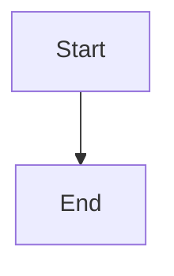

# Upgrade Plan: Migrate to VitePress

## Current State Assessment

This is a VuePress 1.x personal website/blog that needs modernization.

| Component | Current | Target |
|-----------|---------|--------|
| Framework | VuePress 1.9.9 | VitePress 1.x |
| Mermaid | 8.14.0 | 10.x (built-in support) |
| Build Tool | Webpack | Vite |
| Vue | Vue 2 | Vue 3 |

## Why VitePress?

- **Faster builds**: Pure Vite, instant hot reload
- **Simpler config**: Less boilerplate than VuePress
- **Better defaults**: Modern theme out of the box
- **Built-in Mermaid**: Native support via plugin
- **Active development**: More frequent updates than VuePress
- **Smaller bundle**: Lighter output for faster page loads

---

## Phase 1: Project Setup

### 1.1 Initialize New VitePress Project

```bash
# Remove old dependencies
rm -rf node_modules package-lock.json

# Install VitePress
npm add -D vitepress

# Initialize (optional - can configure manually)
npx vitepress init
```

### 1.2 Update package.json

```json
{
  "name": "paul.copplest.one",
  "scripts": {
    "dev": "vitepress dev docs",
    "build": "vitepress build docs",
    "preview": "vitepress preview docs"
  },
  "devDependencies": {
    "vitepress": "^1.5.0"
  }
}
```

### 1.3 Create New Config Structure

Move from `docs/.vuepress/` to `docs/.vitepress/`:

```
docs/
├── .vitepress/
│   ├── config.mts          # Main config (replaces config.js)
│   ├── theme/
│   │   └── index.ts        # Theme customization
│   └── components/         # Custom Vue components
├── blog/
├── knowledge/
└── index.md
```

---

## Phase 2: Configuration Migration

### 2.1 Create `docs/.vitepress/config.mts`

```typescript
import { defineConfig } from 'vitepress'

export default defineConfig({
  title: 'Paul Copplestone',
  description: 'Techie and entrepreneur',
  outDir: '../public',

  themeConfig: {
    nav: [
      { text: 'Blog', link: '/blog/' },
      { text: 'Knowledge', link: '/knowledge/' },
      { text: 'Subscribe', link: 'http://eepurl.com/dE68jj' },
      { text: 'Twitter', link: 'https://twitter.com/kiwicopple' }
    ],

    sidebar: {
      '/blog/': [
        {
          text: 'Blog Posts',
          items: [
            { text: 'Human Memories', link: '/blog/human-memories' },
            { text: 'VR Theory of the World', link: '/blog/vr-theory-of-the-world' },
            { text: 'How DevTools Die', link: '/blog/how-devtools-die' },
            { text: 'Friction Logs', link: '/blog/friction-logs' },
            { text: 'Why Open Source', link: '/blog/why-open-source' },
            { text: 'Profit Sharing', link: '/blog/profit-sharing' },
            { text: 'Realtime User Store', link: '/blog/realtime-user-store' },
            { text: 'Agile', link: '/blog/agile' },
            { text: 'Design', link: '/blog/design' },
            { text: 'How to Learn', link: '/blog/how-to-learn' },
            { text: 'Nimbus Tech 2019-04', link: '/blog/nimbus-tech-2019-04' },
            { text: 'Augmented Reality', link: '/blog/augmented-reality' },
            { text: 'Email to a Friend', link: '/blog/email-to-a-friend' },
            { text: 'Dividing Equity', link: '/blog/dividing-equity' }
          ]
        }
      ],
      '/knowledge/': [
        {
          text: 'Miscellaneous',
          collapsed: false,
          items: [
            { text: 'Chess', link: '/knowledge/chess' },
            { text: 'Climbing', link: '/knowledge/climbing' },
            { text: 'Consciousness', link: '/knowledge/consciousness' },
            // ... add remaining items
          ]
        },
        {
          text: 'Tech',
          collapsed: false,
          items: [
            { text: 'Awesome List', link: '/knowledge/tech/awesome-list' },
            { text: 'Bash Profile', link: '/knowledge/tech/bash-profile' },
            // ... add remaining items
          ]
        },
        {
          text: 'Business',
          collapsed: false,
          items: [
            { text: 'Hiring', link: '/knowledge/business/hiring' },
            { text: 'Management', link: '/knowledge/business/management' },
            // ... add remaining items
          ]
        },
        {
          text: 'Philosophy',
          collapsed: false,
          items: [
            { text: 'Ethics', link: '/knowledge/philosophy/ethics' },
            { text: 'Buddhism', link: '/knowledge/philosophy/buddhism' },
            // ... add remaining items
          ]
        },
        {
          text: 'People',
          collapsed: false,
          items: [
            { text: 'Overview', link: '/knowledge/people' },
            { text: 'Lee Kuan Yew', link: '/knowledge/people/lee-kuan-yew' },
            // ... add remaining items
          ]
        }
      ]
    },

    editLink: {
      pattern: 'https://github.com/kiwicopple/paul.copplest.one/edit/main/docs/:path'
    },

    search: {
      provider: 'local'
    },

    socialLinks: [
      { icon: 'twitter', link: 'https://twitter.com/kiwicopple' },
      { icon: 'github', link: 'https://github.com/kiwicopple' }
    ]
  }
})
```

### 2.2 Config Key Differences

| VuePress 1 | VitePress |
|------------|-----------|
| `module.exports = {}` | `export default defineConfig({})` |
| `themeConfig.sidebar[].children` | `themeConfig.sidebar[].items` |
| `collapsable: false` | `collapsed: false` |
| `dest: 'public'` | `outDir: '../public'` |
| Plugin-based search | Built-in `search: { provider: 'local' }` |

---

## Phase 3: Component Migration

### 3.1 Migrate Custom Components

Current components in `docs/.vuepress/components/`:
- `Mermaid.vue` → Use VitePress Mermaid plugin instead
- `SectionContents.vue` → Update to Vue 3 Composition API
- `PageDetails.vue` → Update to Vue 3 Composition API

### 3.2 Mermaid Support (Built-in)

VitePress has native Mermaid support. Install the plugin:

```bash
npm add -D vitepress-plugin-mermaid mermaid
```

Update config:

```typescript
import { defineConfig } from 'vitepress'
import { withMermaid } from 'vitepress-plugin-mermaid'

export default withMermaid(
  defineConfig({
    // ... your config
  })
)
```

Then use in markdown:

~~~markdown

~~~

### 3.3 Vue 3 Component Example

Convert components from Options API to Composition API:

```vue
<!-- Old (Vue 2 Options API) -->
<script>
export default {
  data() {
    return { count: 0 }
  },
  mounted() {
    console.log('mounted')
  }
}
</script>

<!-- New (Vue 3 Composition API) -->
<script setup>
import { ref, onMounted } from 'vue'

const count = ref(0)

onMounted(() => {
  console.log('mounted')
})
</script>
```

### 3.4 Register Custom Components

Create `docs/.vitepress/theme/index.ts`:

```typescript
import DefaultTheme from 'vitepress/theme'
import SectionContents from '../components/SectionContents.vue'
import PageDetails from '../components/PageDetails.vue'

export default {
  extends: DefaultTheme,
  enhanceApp({ app }) {
    app.component('SectionContents', SectionContents)
    app.component('PageDetails', PageDetails)
  }
}
```

---

## Phase 4: Content Migration

### 4.1 Frontmatter Updates

VitePress frontmatter is mostly compatible. Check for:

```yaml
---
# VuePress 1 specific (remove or update)
meta:
  - name: description
    content: ...

# VitePress format
description: ...
---
```

### 4.2 Markdown Syntax

Most syntax is compatible. Watch for:

- Custom containers: `:::` syntax works the same
- Code blocks: Same syntax
- Links: Relative links should work

### 4.3 Remove VuePress-specific Files

Delete after migration:
- `docs/.vuepress/config.js`
- `docs/.vuepress/styles/*.styl` (migrate to CSS if needed)
- Old component files (after updating)

---

## Phase 5: Styling

### 5.1 Migrate Styles

Convert Stylus to CSS. Create `docs/.vitepress/theme/custom.css`:

```css
:root {
  --vp-c-brand-1: #0000ee;
  --vp-c-brand-2: #0000cc;
  --vp-c-brand-3: #0000aa;
}

/* Custom styles from old index.styl */
```

Import in theme:

```typescript
// docs/.vitepress/theme/index.ts
import DefaultTheme from 'vitepress/theme'
import './custom.css'

export default {
  extends: DefaultTheme
}
```

---

## Phase 6: Analytics & Deployment

### 6.1 Google Analytics

- [ ] **TODO: Migrate from Universal Analytics (UA) to Google Analytics 4 (GA4)**

The current site uses `UA-93673521-3` (Universal Analytics), which has been deprecated. After the VitePress migration is complete, set up GA4:

1. Create a new GA4 property in Google Analytics
2. Get your GA4 Measurement ID (format: `G-XXXXXXXXXX`)
3. Add to VitePress config:

```typescript
// config.mts
export default defineConfig({
  head: [
    ['script', { async: '', src: 'https://www.googletagmanager.com/gtag/js?id=G-XXXXXXXXXX' }],
    ['script', {}, `
      window.dataLayer = window.dataLayer || [];
      function gtag(){dataLayer.push(arguments);}
      gtag('js', new Date());
      gtag('config', 'G-XXXXXXXXXX');
    `]
  ]
})
```

### 6.2 Update Build Scripts

```json
{
  "scripts": {
    "dev": "vitepress dev docs",
    "build": "vitepress build docs",
    "preview": "vitepress preview docs"
  }
}
```

---

## Testing Checklist

After migration, verify:

- [ ] `npm run dev` starts without errors
- [ ] Home page renders correctly
- [ ] All blog posts accessible and formatted
- [ ] All knowledge base articles accessible
- [ ] Navigation (navbar, sidebar) works
- [ ] Mermaid diagrams render
- [ ] Search functionality works
- [ ] Edit links work
- [ ] Mobile responsiveness
- [ ] `npm run build` completes
- [ ] `npm run preview` serves correctly
- [ ] Analytics tracking (if configured)

---

## Migration Order

1. **Setup**: Install VitePress, create new config structure
2. **Config**: Migrate config.js to config.mts
3. **Content**: Update frontmatter if needed
4. **Components**: Migrate to Vue 3 or use built-in alternatives
5. **Styles**: Convert Stylus to CSS
6. **Test**: Run dev server, check all pages
7. **Analytics**: Configure tracking
8. **Build**: Test production build
9. **Deploy**: Update deployment pipeline
10. **Cleanup**: Remove old VuePress files

---

## Resources

- [VitePress Documentation](https://vitepress.dev/)
- [VitePress Mermaid Plugin](https://github.com/emersonbottero/vitepress-plugin-mermaid)
- [Vue 3 Migration Guide](https://v3-migration.vuejs.org/)
- [VitePress Default Theme Reference](https://vitepress.dev/reference/default-theme-config)
